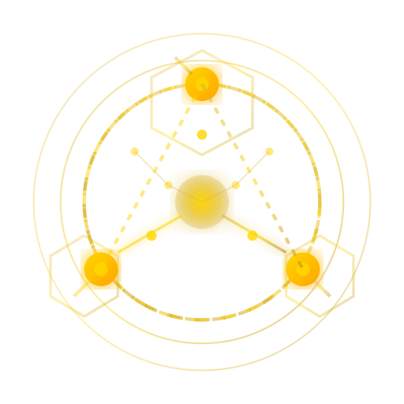

# Luxon Protocol - Character Battle Game

> A minimal yet powerful NFT-based RPG game where players own, battle, and level up unique characters on the blockchain.

## 🎮 About Luxon Protocol

Luxon Protocol is a blockchain gaming infrastructure provider, building the future of player-owned gaming economies. This Character Battle Game demonstrates our core technology stack and commitment to true digital ownership.

### Key Features
- ✅ True NFT ownership (ERC-721)
- ✅ On-chain battle system
- ✅ Progressive character development
- ✅ Secure smart contracts
- ✅ Gas-optimized gameplay

## 🚀 Quick Start

[Installation and usage instructions]
# Create and navigate to project directory
mkdir nft-game
cd nft-game

# Initialize Foundry project
forge init --no-commit

# Or if already in a directory:
forge init --force --no-commit

## 🏗️ Built With
- Solidity ^0.8.20
- Foundry
- OpenZeppelin Contracts

## 📄 Copyright
- Copyright (c) 2025 Luxon Protocol

## 🔗 Links
- Github: https://github.com/LuxonProtocol
- Twitter: https://x.com/luxonprotocol

---

**Developed by Luxon Protocol Team**
- Jesufifunmi Emmanuel